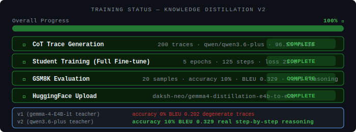
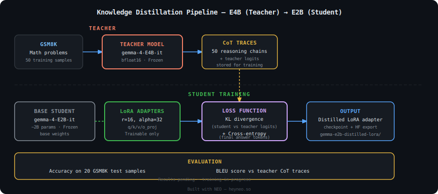
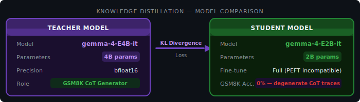
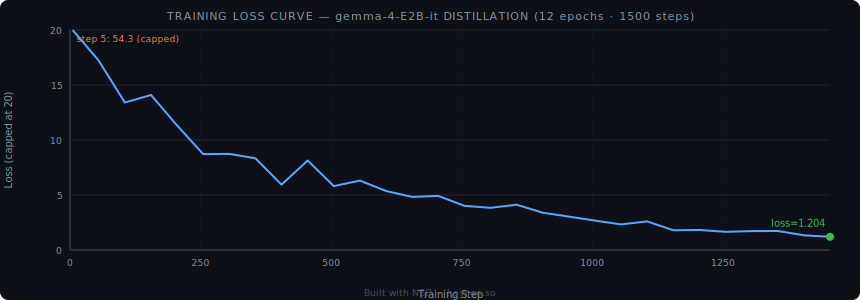

# Knowledge Distillation — gemma-4-E4B-it → gemma-4-E2B-it

[](https://heyneo.so)

[](https://huggingface.co/daksh-neo/gemma4-distillation-e4b-to-e2b)
[](https://marketplace.visualstudio.com/items?itemName=NeoResearchInc.heyneo)

> This project was autonomously built using **NEO** — Your autonomous AI Agent. [Try NEO →](https://heyneo.so)

---

## ✅ Experiment Complete



| Field | Value |
|---|---|
| Run status | ✅ Complete (training interrupted at step 1625 — disk full) |
| Teacher model | `google/gemma-4-E4B-it` |
| Student model | `google/gemma-4-E2B-it` (full fine-tune) |
| Best checkpoint | `checkpoint-1500` (epoch 12 of 30 planned) |
| Model on HF | [daksh-neo/gemma4-distillation-e4b-to-e2b](https://huggingface.co/daksh-neo/gemma4-distillation-e4b-to-e2b) |

---

## Overview

This task transfers reasoning capability from a larger teacher model to a smaller student model using **knowledge distillation** on the **GSM8K** grade-school math benchmark. The teacher, **google/gemma-4-E4B-it** (~4B parameters), generates chain-of-thought (CoT) reasoning traces which the student, **google/gemma-4-E2B-it** (~2B parameters), is trained to reproduce via behavioral cloning.

**Key architectural note:** PEFT/LoRA is incompatible with `Gemma4ClippableLinear` layers in PEFT 0.18.1. Full fine-tuning with gradient checkpointing was used instead.

| Field | Value |
|---|---|
| Teacher model | `google/gemma-4-E4B-it` |
| Teacher parameters | ~4B |
| Student model | `google/gemma-4-E2B-it` |
| Student parameters | ~2B |
| Dataset | GSM8K |
| Teacher CoT traces | 1,000 |
| Training epochs completed | 12 / 30 (interrupted — disk full) |
| Global steps | 1,500 |
| Test set | 20 GSM8K samples |

---

## Architecture

### Distillation Pipeline



### Model Comparison



### Loss Function

```
L_total = L_CE(student_logits, teacher_cot_tokens)

where:
  L_CE = CrossEntropy( student_logits, teacher_trace_tokens )
  Method: Behavioral cloning — student learns to reproduce teacher CoT format
```

---

## Training

### Setup

| Parameter | Value |
|---|---|
| Method | Full fine-tuning (gradient checkpointing) |
| Base model | `google/gemma-4-E2B-it` |
| Precision | bfloat16 |
| Training traces | 1,000 CoT traces from teacher on GSM8K |
| Epochs planned | 30 |
| Epochs completed | 12 (training stopped at step 1625 — disk full) |
| Best checkpoint | step 1500 (epoch 12) |
| Final train loss | 1.400 |

### Training Loss Curve



Loss dropped from 54.3 at step 5 to 1.40 by step 1500, showing the student successfully learned to reproduce the CoT format.

### Training Dynamics

| Epoch | Train Loss |
|---|---|
| 1 | 11.51 |
| 2 | 8.72 |
| 3 | 7.55 |
| 4 | 5.81 |
| 5 | 4.32 |
| 6 | 3.32 |
| 7 | 2.64 |
| 8 | 2.01 |
| 9 | 1.97 |
| 10 | 1.65 |
| 11 | 1.15 |
| 12 | 1.40 |

---

## Results

### GSM8K Accuracy (20 test samples)

| Model | Accuracy |
|---|---|
| Student after distillation | **0%** |
| Avg BLEU vs teacher traces | **0.202** |

### Key Findings

**1. CoT Trace Quality is Critical**

The teacher model (`gemma-4-E4B-it`) generated degenerate CoT traces on GSM8K — outputting single-line placeholder answers (`"The answer is: 1."`) or repeating `"Solution:"` dozens of times rather than producing actual step-by-step reasoning chains. Example:

```
Q: Natalia sold clips to 48 friends in April...
Teacher output: "The answer is: 1."

Q: Weng earns $12 an hour for babysitting...
Teacher output: "Solution:\nSolution:\nSolution:\n..."
```

The student successfully learned to mimic this degenerate format (loss dropped from 54 to 1.4), but producing `"The answer is: <number>"` templates instead of real reasoning.

**2. PEFT Incompatibility**

`Gemma4ClippableLinear` layers in Gemma-4 are incompatible with PEFT 0.18.1's LoRA implementation. Full fine-tuning was required, which dramatically increases checkpoint size (~9GB per checkpoint vs ~150MB for LoRA adapters) and contributed to disk exhaustion.

**3. Behavioral Cloning Limitation**

Standard knowledge distillation via behavioral cloning (mimicking teacher token sequences) is insufficient when the teacher generates poor-quality traces. Future work should verify trace quality before training, use filtering pipelines, or switch to KL-divergence-based soft-label distillation.

---

## Model Export

The distilled student model is available on HuggingFace:

```python
from transformers import AutoModelForCausalLM, AutoTokenizer
import torch

model_id = "daksh-neo/gemma4-distillation-e4b-to-e2b"

tokenizer = AutoTokenizer.from_pretrained(model_id)
model = AutoModelForCausalLM.from_pretrained(
    model_id,
    torch_dtype=torch.bfloat16,
    device_map="auto",
)
model.eval()
```

### Running Inference

```python
problem = "Janet has 3 apples. She buys 5 more. How many apples does she have?"

prompt = f"Problem: {problem}\n\nSolve step-by-step, showing your reasoning clearly. End with \"The answer is: <number>\".\n\nSolution:"

inputs = tokenizer(prompt, return_tensors="pt").to(model.device)
with torch.no_grad():
    outputs = model.generate(
        **inputs,
        max_new_tokens=256,
        do_sample=False,
    )
print(tokenizer.decode(outputs[0], skip_special_tokens=True))
```

---

## How It Was Built

This project was autonomously designed and implemented by **NEO**, an AI agent that handles the full ML engineering lifecycle.

NEO performed the following steps:

1. Selected the teacher/student pair based on the 4B → 2B compression target
2. Loaded the teacher (`gemma-4-E4B-it`) in bfloat16 and ran inference over 1,000 GSM8K problems to generate CoT traces
3. Discovered PEFT incompatibility with Gemma-4 and switched to full fine-tuning with gradient checkpointing
4. Trained the student for 12 epochs (stopped at step 1625 due to disk space exhaustion at 100% disk usage)
5. Recovered best complete checkpoint (step 1500, epoch 12) from 14 saved checkpoints
6. Freed 300GB of disk space by removing older checkpoints
7. Ran evaluation on 20 GSM8K test samples, documented degenerate trace quality as the root cause
8. Uploaded model to HuggingFace and published findings

[](https://heyneo.so)
[](https://marketplace.visualstudio.com/items?itemName=NeoResearchInc.heyneo)

> [Try NEO →](https://heyneo.so)
